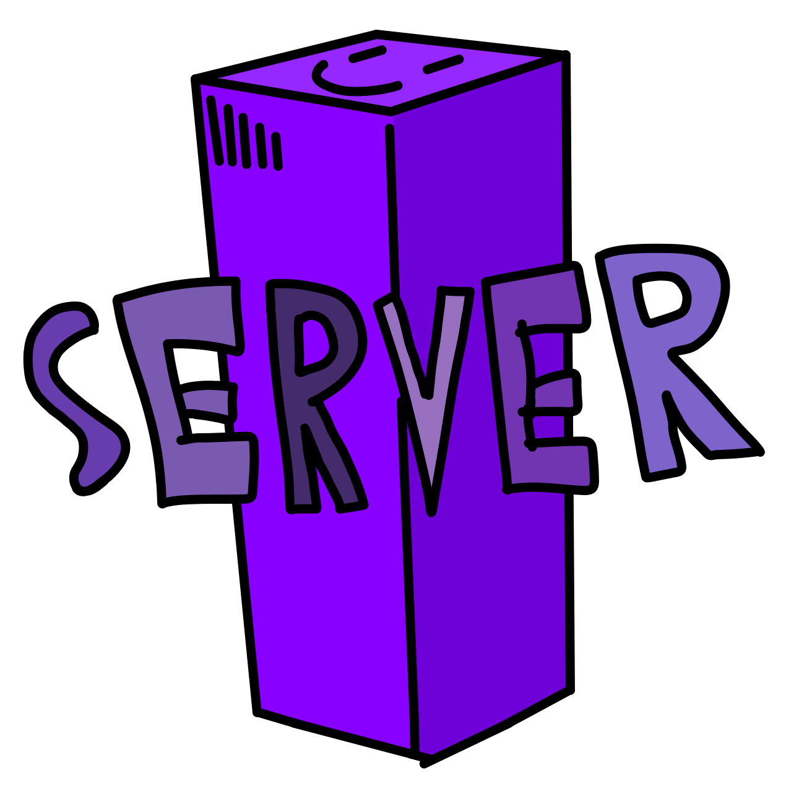

[Join our Discord](https://www.discord.gg/u9B7qkkhtM)

# Dot-Server
The multiplayer server for Dot-Engine

## Usage
Run these commands in a cmd/terminal
```
npm i
npm start
```

## When creating a new Schema it's best to generate on the client.
Again, run this command in a cmd/terminal
```
npx schema-codegen [path/to/Schema.ts] --haxe --output [path/to/output]
```